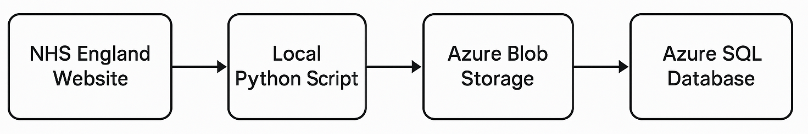
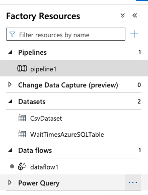
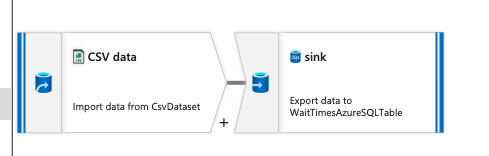
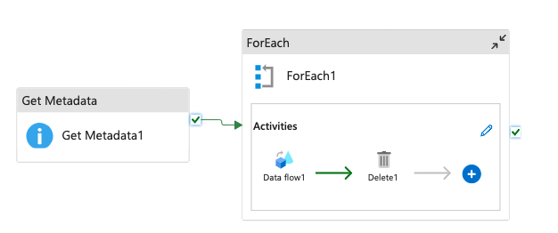

# NHS Diagnostic Waiting Times Data Pipeline  
_Azure Data Factory (ADF) Implementation for NGS Diagnostic Waiting Times_

## Overview

This pipeline automates the extraction, transformation, and loading (ETL) of monthly NHS diagnostic waiting times data from [NHS England](https://www.england.nhs.uk/statistics/statistical-work-areas/diagnostics-waiting-times-and-activity/monthly-diagnostics-waiting-times-and-activity/) into an **Azure SQL Database**. It leverages a local Python script, Azure Blob Storage, and Azure Data Factory (ADF) for end-to-end orchestration.

- **Data Source**: NHS England Monthly Diagnostics Web File Provider  
- **Data Format**: CSV files  
- **Destination**: Azure SQL Database

---

## Architecture Diagram



---

##  Pipeline Components

### 1. Python Download & Upload Script

- **Location**: Local environment  
- **Function**:
  - Scrapes NHS England website to locate the latest CSVs
  - Downloads and uploads them to Azure Blob Storage

####  Requirements

- Python 3.x
- `azure-storage-blob`
- `requests`
- `beautifulsoup4`
- Azure Storage credentials in `.env`

####  Functionality

- Parses NHS webpage using BeautifulSoup
- Finds current month's CSV link
- Downloads Monthly-Diagnostics-Web-File-Provider CSVs
- Calculates the percentage of diagnostics that took over 6 weeks
- Uploads CSVs to Azure Blob Storage

---

### 2. Azure Blob Storage

- **Purpose**: Temporary staging area for raw CSVs
- **Container Name**: `waitingtimesttats`
- **Retention Policy**: Files are deleted after successful ingestion

---

### 3. Azure Data Factory (ADF)

- **Purpose**: Orchestrates data movement and transformation

####  Pipeline Activities

- **Data Flow**:
  - **Source**: Azure Blob (CSV)
  - **Sink**: Azure SQL Database
  - **Format**: CSV with headers
  - **Trigger**: Manual (can be automated)

- **Delete Activity**:
  - **Condition**: Runs after successful copy
  - **Target**: Source CSVs in Blob
  - **Purpose**: Clean up processed files


---

### 4. Azure SQL Database

- **Purpose**: Stores processed NHS diagnostic waiting time data

####  Configuration

- **Authentication**: SQL Auth or Azure Active Directory
- **Main Table**: `diagnosticwaitingtimes_db`

####  Schema

| Column Name              | Description                                         |
|--------------------------|-----------------------------------------------------|
| `region_name`            | Regional team name                                  |
| `diagnostic_id`          | Diagnostic test identifier                          |
| `provider_code`          | Provider unique code                                |
| `provider_name`          | Provider name                                       |
| `percentage_over_6weeks`| % of patients waiting > 6 weeks                     |
| `year`                   | Year of data                                        |
| `month`                  | Month of data                                       |


---

##  Prerequisites

### Azure Resources

- Azure Storage Account + Blob Container
- Azure SQL Database + Table
- Azure Data Factory Instance
- Service connections and linked services configured

### Local Environment

- Python 3.x
- `.env` file containing:

```env
BLOB_CONNECTION_STRING="your_connection_string"
CONTAINER_NAME="nhs-diagnostic-data"
```

---

##  Implementation Steps

### 1. Provision Azure Resources

1. Create Storage Account and Blob container
2. Create SQL Database and `diagnosticwaitingtimes_db` table
3. Set up Azure Data Factory
4. Assign necessary access rights (e.g. contributor to Blob)

---

### 2. Configure Linked Services in ADF

- **Blob Storage**:
  - Use connection string or managed identity
- **SQL Database**:
  - Use SQL authentication or Azure AD
  - Test connections in ADF
  


---

### 3. Create Datasets

- **Source Dataset**:
  - Type: Delimited text (CSV)
  - First row: Header enabled
- **Sink Dataset**:
  - Type: Azure SQL Table
  - Table: `diagnosticwaitingtimes_db`


---

### 4. Build the ADF Pipeline

#### 🛠 Activities

- **Copy Activity**:
  - Source: Blob CSV
  - Sink: SQL table
  - Auto column mapping
- **Delete Activity**:
  - Runs after copy success
  - Logs status for traceability





---

### 5. Set Up & Run Python Script

#### Setup Environment

```bash
python3 -m venv .venv
source .venv/bin/activate
pip install -r requirements.txt
```

####  .env Example

```env
BLOB_CONNECTION_STRING="your_blob_connection_string"
CONTAINER_NAME="nhs-diagnostic-data"
```

#### Run Script

```bash
python src/fetch_and_upload_data.py -y 2024 -m 06
```

Uploads June 2024 data to Azure Blob Storage.

---

##  Running the Pipeline

###  Locally

1. Run the Python script to upload the desired month's data
2. Verify the CSV appears in your Azure Blob container

###  In Azure Data Factory

1. Open ADF Studio
2. Navigate to your pipeline
3. Click **Trigger Now** to run it
4. Monitor status via activity logs

---

## Monitoring & Logging

### Azure Data Factory Studio

- View pipeline run history
- Check activity execution durations
- Inspect logs for any failures


---

## 🔗 Reference Links

- [📊 NHS England Diagnostic Data](https://www.england.nhs.uk/statistics/statistical-work-areas/diagnostics-waiting-times-and-activity/monthly-diagnostics-waiting-times-and-activity/)
- [📘 Azure Data Factory Docs](https://learn.microsoft.com/en-us/azure/data-factory/)
- [🗄️ Azure Blob Storage Docs](https://learn.microsoft.com/en-us/azure/storage/blobs/)
- [🧠 Azure SQL Docs](https://learn.microsoft.com/en-us/azure/azure-sql/)
